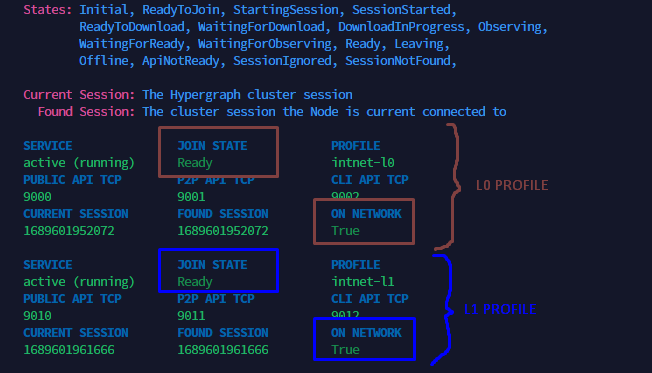
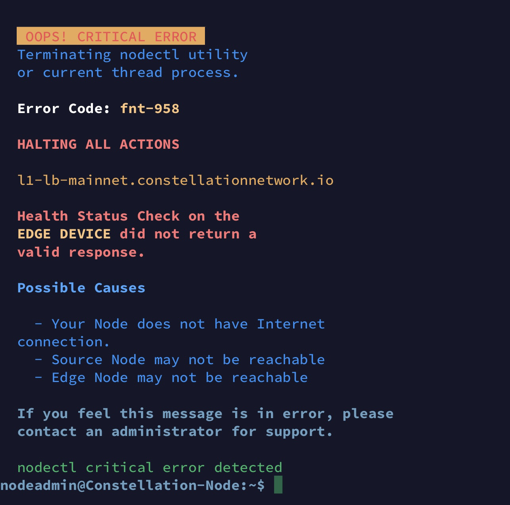

## Contents

- [How do I get started with setting up my node?](#how-do-i-get-started-with-setting-up-my-node)
- [I'm trying to connect to my node but am getting the error "Connection Refused", "Timeout" or a black screen that is not responding](#im-trying-to-connect-to-my-node-but-am-getting-the-error-connection-refused-timeout-or-a-black-screen-that-is-not-responding)
- [I'm trying to connect to my node but am getting the error "No supported authentication methods available (server sent: public key)"](#im-trying-to-connect-to-my-node-but-am-getting-the-error-no-supported-authentication-methods-available-server-sent-public-key)
- [I'm trying to connect to my node but am getting the error "Server refused our key"](#im-trying-to-connect-to-my-node-but-am-getting-the-error-server-refused-our-key)
- [How can I check if my node is online and what do the different join states mean?](#how-can-i-check-if-my-node-is-online-and-what-do-the-different-join-states-mean)
- [One of my profiles is stuck in "Ready (Off Cluster)" state. How can I proceed?](#one-of-my-profiles-is-stuck-in-ready-off-cluster-state-how-can-i-proceed)
- [One of my profiles is stuck in "ApiNotReady" state. How can I proceed?](#one-of-my-profiles-is-stuck-in-apinotready-state-how-can-i-proceed)
- [One of my profiles is stuck in "SessionStarted" state. How can I proceed?](#one-of-my-profiles-is-stuck-in-sessionstarted-state-how-can-i-proceed)
- [One of my profiles is stuck in "DownloadInProgress" state. How can I proceed?](#one-of-my-profiles-is-stuck-in-downloadinprogress-state-how-can-i-proceed)
- [One of my profiles is stuck in "WaitingForDownload" state. How can I proceed?](#one-of-my-profiles-is-stuck-in-waitingfordownload-state-how-can-i-proceed)
- [One of my profiles is stuck in "ReadyToJoin" state. How can I proceed?](#one-of-my-profiles-is-stuck-in-readytojoin-state-how-can-i-proceed)
- [I'm getting the error "INTERNAL ERROR: cannot create temporary directory" when executing a nodectl command](#im-getting-the-error-internal-error-cannot-create-temporary-directory-when-executing-a-nodectl-command)
- [I'm getting the error "fnt-958" when executing a nodectl command](#im-getting-the-error-fnt-958-when-executing-a-nodectl-command)
- [How can I get notifications when my node goes offline?](#how-can-i-get-notifications-when-my-node-goes-offline)
- [How can I install Ubuntu security updates on my system?](#how-can-i-install-ubuntu-security-updates-on-my-system)
- [How can I check if I still receive rewards?](#how-can-i-check-if-i-still-receive-rewards)

## How do I get started with setting up my node?

- Follow the steps from the [official documentation](https://docs.constellationnetwork.io/validate)

- A step-by-step video tutorial is available here: [https://www.youtube.com/watch?v=5Nxof84PJuA](https://www.youtube.com/watch?v=5Nxof84PJuA)

- Unofficial step-by-step guides for Digital Ocean and Hetzner are available on the [DAG Chads Telegram Group](https://t.me/dagchadsofficial)

## I'm trying to connect to my node but am getting the error "Connection Refused", "Timeout" or a black screen that is not responding

Most likely, the firewall on your node is blocking your connection. Check the firewall settings on your VPS and make sure your IP address from your current access point, which you can find on [https://whatsmyip.org/](https://whatsmyip.org/), is whitelisted on your SSH port (default = 22)

Another common error could be that you are connecting to the wrong IP address. Be sure to connect to your VPS (droplet) IP address in putty/terminal

## I'm trying to connect to my node but am getting the error "No supported authentication methods available (server sent: public key)"

This error indicates that you aren't connecting using an SSH key. Check your SSH client and see if you have configured authentication using your SSH private key.

## I'm trying to connect to my node but am getting the error "Server refused our key"

This error indicates that the server is not allowing the connection. This can have 2 causes:

- You aren't connecting with the correct username. Make sure to use `nodeadmin` or whichever custom name you choose during the setup. Or if it's a fresh node where nothing is installed on yet, try `root` or `ubuntu` user
- You didn't configure the correct SSH key in your SSH client. Double check the configuration

## How can I check if my node is online and what do the different join states mean?

You can check the status through the command:

```bash
sudo nodectl status
```

<br />

- Check the `JOIN STATE` column and verify all your profiles are in `Ready` state
- Check the `ON NETWORK` column and verify all your profiles show as `TRUE`.
- Check the `IN CONSENSUS` column for your L0 profile and check if it shows as `TRUE`.



Here is the overview of the most common join states:

- **Ready**: this means your node is part of the network and online. All is good! **No actions needed**
- **Ready (off cluster)**: your node has forked. Check this [solution](#one-of-my-profiles-is-stuck-in-ready-off-cluster-state-how-can-i-proceed)
- **ApiNotReady**: this means your node service isn't started. This usually occurs after you performed a reboot, since the services aren't started automatically. Check this [solution](#one-of-my-profiles-is-stuck-in-apinotready-state-how-can-i-proceed)
- **SessionStarted**: this means your node is requesting to join the network, but hasn't been accepted yet. Normally, the state transitions after a couple minutes. If it stays stuck in SessionStarted state, then the network might be rejecting your node from joining the network. Check this [solution](#one-of-my-profiles-is-stuck-in-sessionstarted-state-how-can-i-proceed)
- **WaitingForDownload**: this means not all snapshots have been downloaded yet on your node. A background process will start downloading snapshots when it detects this state, so it should transition to the "DownloadInProgress" state. If not, check this [solution](#one-of-my-profiles-is-stuck-in-waitingfordownload-state-how-can-i-proceed)
- **DownloadInProgress**: this means your node is currently downloading & validating missing snapshots from the network. This can take some time depending on the amount of snapshots it needs to download. **No actions needed**. [More Information](#one-of-my-profiles-is-stuck-in-downloadinprogress-state-how-can-i-proceed)
- **ReadyToJoin**: this means your node is ready to join the network, but hasn't joined it yet. You'll need to manually join the network with [these steps.](#one-of-my-profiles-is-stuck-in-readytojoin-state-how-can-i-proceed)
- **WaitingForObserving**: this means your node has finished downloading the snapshots and will about to transition to "Observing" state. **No actions needed**
- **Observing**: this means your node has joined the network but is not actively participating to consensus yet. It observes the first couple of consensus rounds before actively participating. This state usually changes after a couple of minutes. **No actions needed** (unless it takes more than 30 minutes, if so, try a restart of your profiles with the command:

  ```bash
  sudo nodectl restart -p all
  ```

## One of my profiles is stuck in "Ready (Off Cluster)" state. How can I proceed?

This means your node is active but is participating in consensus rounds on a forked minority network. Restart your metagraphs when you see this:

```bash
sudo nodectl restart -p all
```

## One of my profiles is stuck in "ApiNotReady" state. How can I proceed?

Restart your metagraph services with the following command:

```bash
sudo nodectl restart -p all
```

If this did not fix your problem, try rebooting your system and try the above command again after that. If it still does not work after that, get in touch with a teamlead for further troubleshooting.

## One of my profiles is stuck in "SessionStarted" state. How can I proceed?

This can have multiple causes:

- **Incorrect firewall configuration**: make sure the necessary ports are open on your firewall

- **Tessellation version mismatch**: check if your tessellation version is still up to date, using the command:

  ```bash
  sudo nodectl -cv
  ```

  If your version is outdated, upgrade it using the command:

  ```bash
  sudo nodectl upgrade
  ```

- **Corrupt Binaries**: it can happen that your tessellation binaries get corrupted. You can refresh these with below command:

  ```bash
  sudo nodectl refresh_binaries
  ```

<br />

- **Your node ID is not whitelisted**: you can check this with the below command

  <details>
    <summary>click here to view the command for integrationnet</summary>

  <pre><code>sudo nodectl check_seedlist -p intnet-l0</code></pre>

  </details>

  <details>
    <summary>click here to view the command for testnet/mainnet</summary>

  <pre><code>sudo nodectl check_seedlist -p dag-l0</code></pre>

  </details>

  <br />

  You should see `TRUE` under `NODE ID FOUND ON SEED LIST`. If it shows as `FALSE`, it means your node is not on the whitelist. Get in touch with a teamlead.

- **Insufficient collateral** *(Mainnet only)*: verify that your wallet still contains the required collateral. This is only applicable for mainnet nodes.

## One of my profiles is stuck in "DownloadInProgress" state. How can I proceed?

No action should be taken when it's in DownloadInProgress! This means your node is downloading & validating the snapshots from the cluster. If it's the first time your node joins the network or it was offline for an extensive amount of time, then this can take several days to complete.

You can roughly follow the progress with below command, but bear in mind the ETA & % progress are not accurate, since it's very hard to estimate that!

```bash
sudo nodectl download_status
```

(choose your L0 profile after running above command)

It can happen that you see "paused" in above output. This does not mean it's not doing anything anymore. It means that the snapshots are downloaded and it's now going through the validation of the snapshots.

The way this process works, is it's first downloading all the missing snapshots from the network to a TMP directory. After the snapshots are downloaded, it will validate all blocks inside the snapshots and moves the validated snapshots to a permanent storage folder.

## One of my profiles is stuck in "WaitingForDownload" state. How can I proceed?

This can happen when there is a technical issue with the download of snapshots or your local snapshot storage contains an invalid snapshot.

Check if this command displays an error message:

<details>
  <summary>click here to view the command for testnet or mainnet</summary>

<pre><code>sudo grep -a -B 15 -A 5 "Unexpected failure during download" /var/tessellation/dag-l0/logs/app.log | tail -n 21</code></pre>
</details>

<details>
  <summary>click here to view the command for integrationnet</summary>

<pre><code>sudo grep -a -B 15 -A 5 "Unexpected failure during download" /var/tessellation/intnet-l0/logs/app.log | tail -n 21</code></pre>

</details>

<br />

If you see an error that contains "buffer too small" or "buffer overflow", then that usually indicates you have a corrupt snapshot. Contact a teamlead when this happens.

## One of my profiles is stuck in "ReadyToJoin" state. How can I proceed?

If you see this on your **L0 profile**, you can join the network with this command:

<details>
  <summary>click here to view the command for testnet or mainnet</summary>

<pre><code>sudo nodectl join -p dag-l0</code></pre>

</details>

<details>
  <summary>click here to view the command for integrationnet</summary>

<pre><code>sudo nodectl join -p intnet-l0</code></pre>

</details>

<br />

If you see this on your **L1 profile**, first check the status of your L0 profile. This needs to be in **Ready** join state BEFORE you join your L1 profile.

*Your Layer 1 needs a trusted Layer 0 for connecting to the cluster and the most trusted L0 is yourself. Your L1 cannot use your L0 until your L0 is in status ready.*

After confirming your L0 is in **Ready** state, you can join your L1 with this command:

<details>
  <summary>click here to view the command for testnet or mainnet</summary>

<pre><code>sudo nodectl join -p dag-l1</code></pre>

</details>

<details>
  <summary>click here to view the command for integrationnet</summary>

<pre><code>sudo nodectl join -p intnet-l1</code></pre>

</details>

## I'm getting the error "INTERNAL ERROR: cannot create temporary directory" when executing a nodectl command

This means you have a full disk. Check if you can clean obsolete files or check with a teamlead on the next steps.

## I'm getting the error "fnt-958" when executing a nodectl command

When executing a nodectl command, it shows me the error code "fnt-958". This usually happens when the network loadbalancer is unavailable. You will probably not be the only one that has this issue and will need to wait until the loadbalancer is available again. You can check if the loadbalancer is online by browing to the following URLs:

- L0 Mainnet: [https://l0-lb-mainnet.constellationnetwork.io/cluster/info](https://l0-lb-mainnet.constellationnetwork.io/cluster/info)
- L1 Mainnet: [https://l1-lb-mainnet.constellationnetwork.io/cluster/info](https://l1-lb-mainnet.constellationnetwork.io/cluster/info)
- L0 Integrationnet: [https://l0-lb-integrationnet.constellationnetwork.io/cluster/info](https://l0-lb-integrationnet.constellationnetwork.io/cluster/info)
- L1 Integrationnet: [https://l1-lb-integrationnet.constellationnetwork.io/cluster/info](https://l1-lb-integrationnet.constellationnetwork.io/cluster/info)
- L0 Testnet: [https://l0-lb-testnet.constellationnetwork.io/cluster/info](https://l0-lb-testnet.constellationnetwork.io/cluster/info)
- L1 Testnet: [https://l1-lb-testnet.constellationnetwork.io/cluster/info](https://l1-lb-testnet.constellationnetwork.io/cluster/info)



## How can I get notifications when my node goes offline?

You can use uptimerobot to monitor if your node is still part of the network cluster. The configuration is described [here](https://constellation.nebula-tech.io/knowledgebase/server-monitoring)

You can also use [this Discord bot](https://discord.gg/AnhdA9vnKN), developed by [Michael](https://twitter.com/toemmerflaade), to get notified when your node goes down.

## How can I install Ubuntu security updates on my system?

The steps are described [here](https://constellation.nebula-tech.io/knowledgebase/server-updates)

After a reboot (if that is needed), join the network again with this command:

```bash
sudo nodectl restart -p all
```

You can activate [Ubuntu Pro](https://constellation.nebula-tech.io/knowledgebase/ubuntu-pro) as well, to enable the live patching service, which can install kernel updates automatically without the need to perform a reboot afterwards. You will still need to install the security patches manually though!

## How can I check if I still receive rewards?

Rewards are distributed in different ways, depending on the network your are in.

### Mainnet

In mainnet, rewards are distributed per time-triggered snapshot by the protocol (happens roughly every minute). These rewards are minted directly into your node wallet, so it doesn't appear as transactions in dagexplorer or stargazer. There are different ways to check rewards:

- Use nodectl to quickly check when you last received a reward:

  ```bash
  sudo nodectl dag -p dag-l0
  ```

- Use the community built reward explorer and enter your node wallet address, to view the rewards. Rewards are aggregated by day (UTC timezone): [https://constellation.nebula-tech.io/reward-explorer](https://constellation.nebula-tech.io/reward-explorer)

If you notice you aren't receiving rewards anymore, checkout this section to see if your node is still healthy: [How can I check if my node is online and what do the different join states mean?](#how-can-i-check-if-my-node-is-online-and-what-do-the-different-join-states-mean)

### Integrationnet or Testnet

In these networks, rewards are distributed on a daily base by Lattice. Your node needs to have been online for at least 1 hour in the last 72 hours, to be elligable for rewards. The wallet that you linked in Lattice that receives the rewards also needs to have the 250k DAG collateral.
