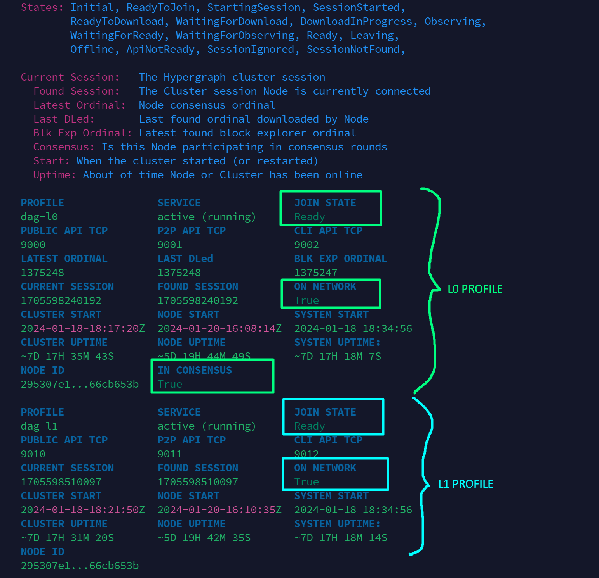

## Contents

- [How do I get started with setting up my node?](#how-do-i-get-started-with-setting-up-my-node)
- [I'm trying to connect to my node but am getting the error "Connection Refused", "Timeout" or a black screen that is not responding](#im-trying-to-connect-to-my-node-but-am-getting-the-error-connection-refused-timeout-or-a-black-screen-that-is-not-responding)
- [How can I check if my node is online and what do the different join states mean?](#how-can-i-check-if-my-node-is-online-and-what-do-the-different-join-states-mean)
- [One of my profiles is stuck in "ApiNotReady" state. How can I proceed?](#one-of-my-profiles-is-stuck-in-apinotready-state-how-can-i-proceed)
- [One of my profiles is stuck in "SessionStarted" state. How can I proceed?](#one-of-my-profiles-is-stuck-in-sessionstarted-state-how-can-i-proceed)
- [One of my profiles is stuck in "WaitingForDownload" state. How can I proceed?](#one-of-my-profiles-is-stuck-in-waitingfordownload-state-how-can-i-proceed)
- [One of my profiles is stuck in "ReadyToJoin" state. How can I proceed?](#one-of-my-profiles-is-stuck-in-readytojoin-state-how-can-i-proceed)
- [I'm getting the error "INTERNAL ERROR: cannot create temporary directory" when executing a nodectl command](#im-getting-the-error-internal-error-cannot-create-temporary-directory-when-executing-a-nodectl-command)
- [I'm getting the error "/usr/local/bin/nodectl: 1: Syntax error: "(" unexpected" when executing a nodectl command](#im-getting-the-error-usrlocalbinnodectl-1-syntax-error--unexpected-when-executing-a-nodectl-command)
- [How can I get notifications when my node goes offline?](#how-can-i-get-notifications-when-my-node-goes-offline)
- [How can I install Ubuntu security updates on my system?](#how-can-i-install-ubuntu-security-updates-on-my-system)

## How do I get started with setting up my node?
- Follow the steps from the [official documentation](https://docs.constellationnetwork.io/validate)

- A video tutorial is also available here: [https://www.youtube.com/watch?v=5Nxof84PJuA](https://www.youtube.com/watch?v=5Nxof84PJuA)

## I'm trying to connect to my node but am getting the error "Connection Refused", "Timeout" or a black screen that is not responding

Most likely, the firewall on your node is blocking your connection. Check the firewall settings on your VPS and make sure your IP address from your current access point, which you can find on [https://whatsmyip.org/](https://whatsmyip.org/), is whitelisted on your SSH port (default = 22) 

Another common error could be that you are connecting to the wrong IP address. Be sure to connect to your VPS (droplet) IP address in putty/terminal

## How can I check if my node is online and what do the different join states mean?

You can check the status through the command: 

```
sudo nodectl status
```
<br>
- Check the **JOIN STATE** column and verify all your profiles are in **Ready** state 
- Check the **ON NETWORK** column and verify all your profiles show as **TRUE**.




Here is the overview of the most common join states:

- **ApiNotReady**: this means your node service isn't started. This usually occurs after you performed a reboot, since the services aren't started automatically. Check this [solution](#one-of-my-profiles-is-stuck-in-apinotready-state-how-can-i-proceed)
- **SessionStarted**: this means your node is unable to join the cluster for some reason. Check this [solution](#one-of-my-profiles-is-stuck-in-sessionstarted-state-how-can-i-proceed)
- **WaitingForDownload**: this means not all snapshots have been downloaded yet on your node. A background process will start downloading snapshots when it detects this state, so it should transition to the "DownloadInProgress" state. If not, check this [solution](#one-of-my-profiles-is-stuck-in-waitingfordownload-state-how-can-i-proceed)
- **DownloadInProgress**: this means your node is currently downloading the snapshot history. This can take some time depending on the amount of snapshots it needs to download. **No actions needed**
- **ReadyToJoin**: this means your node is ready to join the network, but hasn't joined it yet. You'll need to manually join the network with [these steps.](#one-of-my-profiles-is-stuck-in-readytojoin-state-how-can-i-proceed)
- **WaitingForObserving**: this means your node has finished downloading the snapshots and will about to transition to "Observing" state. **No actions needed**
- **Observing**: this means your node has joined the network but is not actively participating to consensus yet. It observes the first couple of consensus rounds before actively participating. This state usually changes after a couple of minutes. **No actions needed** (unless it takes more than 30 minutes, if so, try a restart of your profiles with the command: 

  ```
  sudo nodectl restart -p all
  ```
<br>
- **Ready**: this means your node is part of the network and online. All is good! **No actions needed**

## One of my profiles is stuck in "ApiNotReady" state. How can I proceed?

Restart your metagraph services with the following command:

```
sudo nodectl restart -p all
```

If this did not fix your problem, try rebooting your system and try the above command again after that. If it still does not work after that, get in touch with a teamlead for further troubleshooting.


## One of my profiles is stuck in "SessionStarted" state. How can I proceed?

This can have multiple causes:
- **Incorrect firewall configuration**: make sure the necessary ports are open on your firewall

- **Tessellation version mismatch**: check if your tessellation version is still up to date, using the command: 

  ```
  sudo nodectl -cv
  ```

  If your version is outdated, upgrade it using the command:

  ```
  sudo nodectl upgrade
  ```
<br>

- **Your node ID is not whitelisted**: you can check this with the below command 

  <details>
    <summary>click here to view the command for integrationnet</summary>

  <pre><code>sudo nodectl check_seedlist -p intnet-l0</code></pre>

  </details>

  <details>
    <summary>click here to view the command for testnet/mainnet</summary>

  <pre><code>sudo nodectl check_seedlist -p dag-l0</code></pre>

  </details>

  You should see `TRUE` under `NODE ID FOUND ON SEED LIST`. If it shows as `FALSE`, it means your node is not on the whitelist. Get in touch with a teamlead.


- **Insufficient collateral** *(Mainnet only)*: verify that your wallet still contains the required collateral. This is only applicable for mainnet nodes.

## One of my profiles is stuck in "WaitingForDownload" state. How can I proceed?

Inform your teamlead in the designated team channels about your issue and follow these steps to upload your logs:

<pre><code>sudo nodectl -sl -p intnet-l0</code></pre>

Choose `c` (for current logs)

Choose `y` when it asks to upload

This should generate a link in the form of `https://transfer.sh/....`, copy that link and send it to your teamlead, so we can download the logs.

## One of my profiles is stuck in "ReadyToJoin" state. How can I proceed?

If you see this on your **L0 profile**, you can join the network with this command:

<details>
  <summary>click here to view the command for testnet or mainnet</summary>

<pre><code>sudo nodectl join -p dag-l0</code></pre>

</details>

<details>
  <summary>click here to view the command for integrationnet</summary>

<pre><code>sudo nodectl join -p intnet-l0</code></pre>

</details>

If you see this on your **L1 profile**, first check the status of your L0 profile. This needs to be in **Ready** join state BEFORE you join your L1 profile.

*Your Layer 1 needs a trusted Layer 0 for connecting to the cluster and the most trusted L0 is yourself. Your L1 cannot use your L0 until your L0 is in status ready.*

After confirming your L0 is in **Ready** state, you can join your L1 with this command:

<details>
  <summary>click here to view the command for testnet or mainnet</summary>

<pre><code>sudo nodectl join -p dag-l1</code></pre>

</details>

<details>
  <summary>click here to view the command for integrationnet</summary>

<pre><code>sudo nodectl join -p intnet-l1</code></pre>

</details>

## I'm getting the error "INTERNAL ERROR: cannot create temporary directory" when executing a nodectl command

This means you have a full disk. The fix should only be applied on mainnet, do NOT execute this command on any other environment and check with a teamlead first for further steps:

> !! ONLY FOR MAINNET

> If you encounter this issue on testnet/integrationnet, reach out in discord for further steps

> !! Be very cautious with these commands and **do not make any typos** as this permanently removes files from your system

Command:
```
sudo find /var/tessellation/dag-l0/data/snapshot/ -type f -mtime +30 -delete
```

## I'm getting the error "/usr/local/bin/nodectl: 1: Syntax error: "(" unexpected" when executing a nodectl command

This indicates you used the wrong `wget` link to download nodectl. There are 2 different links available to install nodectl, that work on different CPU architectures.

Run this command to know the CPU architecture of your node:

```
lscpu | grep "Architecture"
```

Then execute the appropriate nodectl download command for that CPU architecture.

## How can I get notifications when my node goes offline?

You can use uptimerobot to monitor if your node is still part of the network cluster. The configuration is described [here](https://constellation.nebula-tech.io/knowledgebase/server-monitoring)

## How can I install Ubuntu security updates on my system?

The steps are described [here](https://constellation.nebula-tech.io/knowledgebase/server-updates)

After a reboot (if that is needed), join the network again with this command:

```
sudo nodectl restart -p all
```